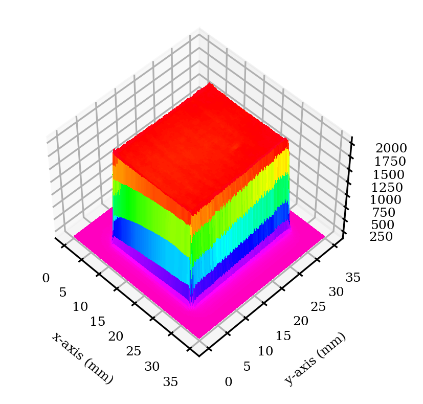

============
BeamProfiler
============

.. image:: https://img.shields.io/pypi/v/beamprofiler.svg
        :target: https://pypi.python.org/pypi/beamprofiler

.. image:: https://app.travis-ci.com/wagnojunior/beamprofiler.svg?branch=main
        :target: https://app.travis-ci.com/wagnojunior/beamprofiler

.. image:: https://readthedocs.org/projects/beamprofiler/badge/?version=latest
        :target: https://beamprofiler.readthedocs.io/en/latest/?version=latest
        :alt: Documentation Status

**BeamProfiler** is a Python package for laser beam analysis and characterization
according to ISO 13694, ISO 11145, and other non-ISO definitions commonly used
in the industry.

* Free software: GNU General Public License v3
* Documentation: https://beamprofiler.readthedocs.io.

Features
--------

**BeamProfiler** imports the power density distribution of a laser beam and
generates a `.xlsx` report with the following items:

ISO parameters:
    total power, clip-level power, maximum power density, clip-level
    power density, clip-level average power density, clip-level irradiation
    area, beam aspect ratio, fractional power, flatness factor, beam
    uniformity, plateau uniformity, edge steepness, beam centroid, beam width.

Non-ISO parameters:
    clip-level beam width, clip-level edge width, modified plateau uniformity,
    top-hat factor.
  
Auxiliary graphs
    histogram, 2D heat map, 3D heat map, normalized energy curve.
    

Below are some illustrations:

 
   Beam analysis report of ISO and non-ISO parameters
   

 
   Histogram  

 
   2D heat map
 
   

 
   3D heat map  

 

 
   Normalized energy curve

Credits
-------

This package was created with Cookiecutter_ and the `audreyr/cookiecutter-pypackage`_ project template.

.. _Cookiecutter: https://github.com/audreyr/cookiecutter
.. _`audreyr/cookiecutter-pypackage`: https://github.com/audreyr/cookiecutter-pypackage
